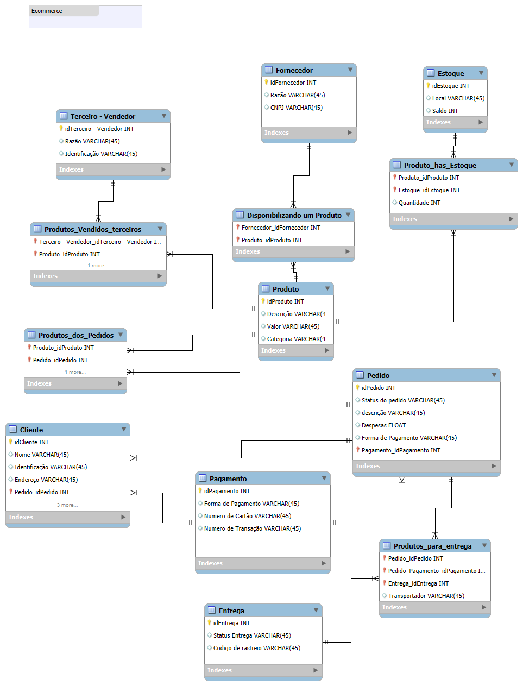

# Modelagem de Dados para E-commerce

Este repositório contém a modelagem de dados conceitual para um sistema de e-commerce. O objetivo deste projeto é estruturar um banco de dados relacional que suporte as principais operações de uma loja virtual, incluindo gerenciamento de produtos, clientes, pedidos, pagamentos, estoque e entregas.

## Visão Geral do Modelo

O diagrama de entidade-relacionamento (DER) foi projetado para ser flexível, permitindo que a plataforma opere com produtos de fornecedores próprios e também como um marketplace, com vendedores terceirizados.

## Estrutura e Entidades

O modelo é composto pelas seguintes entidades principais, representando os diferentes contextos do negócio:

### 1. Clientes e Pedidos

* **`Cliente`**: Armazena as informações cadastrais dos clientes.
    * `idCliente`: Chave primária.
    * `Nome`: Nome completo do cliente.
    * `Identificação`: Documento de identificação (CPF/CNPJ).
    * `Endereço`: Endereço de cadastro do cliente.

* **`Pedido`**: Registra cada compra realizada por um cliente.
    * `idPedido`: Chave primária.
    * `Status do Pedido`: Status atual do pedido (ex: "Aguardando Pagamento", "Enviado", "Entregue").
    * `Descrição`: Descrição ou observação sobre o pedido.
    * `Despesas`: Valor do frete.
    * `Cliente_idCliente`: Chave estrangeira para a tabela `Cliente`.
    * `Pagamento_idPagamento`: Chave estrangeira para a tabela `Pagamento`.

### 2. Produtos e Estoque

* **`Produto`**: Tabela central de produtos, contendo informações genéricas.
    * `idProduto`: Chave primária.
    * `Descrição`: Nome ou descrição do produto.
    * `Valor`: Preço do produto.
    * `Categoria`: Categoria à qual o produto pertence.

* **`Estoque`**: Gerencia os locais de armazenamento dos produtos.
    * `idEstoque`: Chave primária.
    * `Local`: Nome ou identificação do local de estoque.
    * `Saldo`: Saldo total do estoque (pode ser removido se o controle for por produto).

* **`Produto_has_Estoque`**: Tabela associativa que informa a quantidade de um produto em um determinado estoque.
    * `Produto_idProduto`: Chave estrangeira para `Produto`.
    * `Estoque_idEstoque`: Chave estrangeira para `Estoque`.
    * `Quantidade`: Quantidade do produto disponível naquele estoque.

### 3. Fornecedores e Vendedores Terceirizados (Marketplace)

* **`Fornecedor`**: Empresas que fornecem produtos para o e-commerce.
    * `idFornecedor`: Chave primária.
    * `Razão Social`: Nome da empresa fornecedora.
    * `CNPJ`: CNPJ do fornecedor.

* **`Disponibilizando um Produto`**: Tabela associativa que liga os produtos aos seus fornecedores.

* **`Terceiro - Vendedor`**: Vendedores independentes que utilizam a plataforma para vender seus produtos.
    * `idTerceiro - Vendedor`: Chave primária.
    * `Razão Social`: Nome do vendedor.
    * `Identificação`: Documento de identificação (CPF/CNPJ).

* **`Produtos_Vendedores_terceiros`**: Tabela associativa que define quais produtos são vendidos por quais vendedores terceirizados.

### 4. Transações e Logística

* **`Pagamento`**: Detalhes sobre a transação financeira de um pedido.
    * `idPagamento`: Chave primária.
    * `Forma de Pagamento`: Método utilizado (ex: "Cartão de Crédito", "Boleto").
    * `Numero do Cartão`: Número do cartão (deve ser tratado com segurança).
    * `Numero de Transação`: Código da transação gerado pelo gateway.

* **`Entrega`**: Informações sobre o envio dos pedidos.
    * `idEntrega`: Chave primária.
    * `Status Entrega`: Status da entrega (ex: "Em trânsito", "Entregue").
    * `Codigo de rastreio`: Código para rastreamento do envio.

* **`Produtos_para_entrega`**: Tabela associativa que vincula os itens do pedido à sua respectiva entrega.

### 5. Tabelas Associativas (Junction Tables)

* **`Produtos_dos_Pedidos`**: Liga os produtos aos pedidos, formando o carrinho de compras. É o "item do pedido".
* **`Produto_has_Estoque`**: Controla o inventário de cada produto em cada local de estoque.
* **`Disponibilizando um Produto`**: Associa produtos a fornecedores.
* **`Produtos_Vendedores_terceiros`**: Associa produtos a vendedores do marketplace.
* **`Produtos_para_entrega`**: Associa os itens de um pedido a uma entrega específica.

## Como Utilizar

Este modelo pode ser usado como base para a criação de um banco de dados físico em qualquer SGBD relacional, como MySQL, PostgreSQL, SQL Server, etc. Os scripts para a criação das tabelas (`CREATE TABLE`) podem ser desenvolvidos a partir deste diagrama.

## Possíveis Melhorias e Próximos Passos

* **Normalização de Endereços:** A entidade `Cliente` pode ter seu atributo `Endereço` decomposto em campos como `logradouro`, `numero`, `cidade`, `estado` e `CEP` para facilitar a logística e a validação.
* **Atributos em Tabelas Associativas:** Adicionar campos como `quantidade` e `preco_unitario` na tabela `Produtos_dos_Pedidos`.
* **Tipos de Dados:** Revisar os tipos de dados para otimização, utilizando `DECIMAL` para valores monetários e `ENUM` ou tabelas de domínio para campos de status e categoria.
* **Segurança:** Implementar uma camada de segurança para dados sensíveis, como o `Numero do Cartão` na tabela `Pagamento`.
* **Índices:** Adicionar índices nas chaves estrangeiras (`Foreign Keys`) e em colunas frequentemente consultadas para otimizar a performance das queries.
