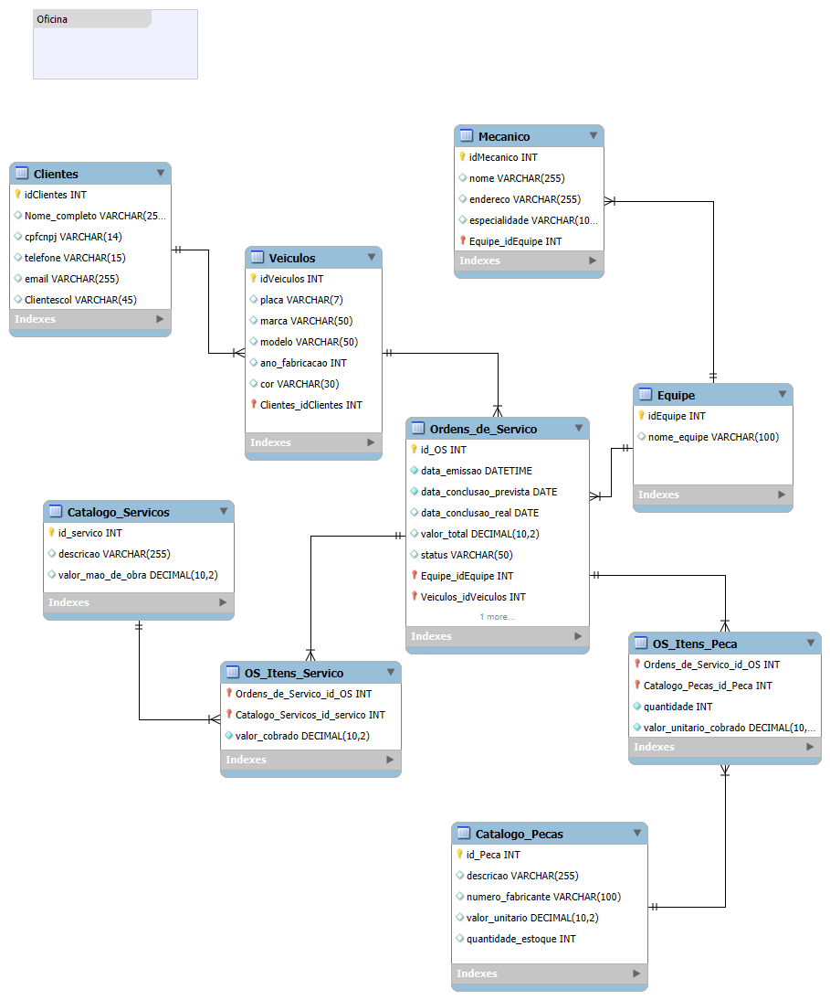

# Modelagem de Dados para Sistema de Gerenciamento de Oficina Mecânica

Este repositório apresenta a modelagem de dados conceitual para um sistema de controle e gerenciamento de execução de Ordens de Serviço (OS) em uma oficina mecânica. O objetivo é criar uma estrutura de banco de dados robusta que suporte o fluxo de trabalho desde a chegada do veículo até a conclusão dos serviços e registro final.

## Visão Geral do Modelo

O Diagrama de Entidade-Relacionamento (DER) abaixo ilustra as principais entidades do sistema e seus relacionamentos, garantindo a integridade e a rastreabilidade das informações.

## Desenvolvimento da Modelagem

A modelagem foi desenvolvida com base nos seguintes requisitos e processos de negócio da oficina:

1.  **Cadastro de Clientes e Veículos:** Clientes trazem seus veículos para manutenção ou reparo. Cada veículo é associado a um cliente.
2.  **Organização por Equipes:** Os mecânicos são organizados em equipes, e cada Ordem de Serviço é designada a uma equipe específica.
3.  **Processo da Ordem de Serviço (OS):**
    * A equipe designada identifica os serviços necessários e preenche uma OS.
    * A OS contém detalhes como data de emissão, data prevista para conclusão, status e os valores associados.
    * Os valores da OS são compostos pelo custo da mão de obra (consultando um catálogo de serviços) e o custo das peças (consultando um catálogo de peças).
    * O cliente precisa autorizar a execução dos serviços antes que a OS avance para a etapa de execução.
4.  **Execução e Avaliação:** A mesma equipe que avaliou os serviços é responsável pela sua execução.
5.  **Gestão de Pessoas:** Os mecânicos são cadastrados com informações básicas e sua especialidade.

## Estrutura e Entidades Detalhadas

O modelo é composto pelas seguintes entidades e seus atributos:

### 1. Clientes

* **Descrição:** Armazena os dados dos proprietários dos veículos.
* **Atributos:**
    * `idClientes` (INT, PK, Auto_Increment)
    * `nome_completo` (VARCHAR(255), NOT NULL)
    * `cpfcnpj` (VARCHAR(14), NOT NULL, UNIQUE) - Documento de identificação do cliente.
    * `telefone` (VARCHAR(15))
    * `email` (VARCHAR(255), UNIQUE)
    * `Clientescol` (VARCHAR(45)) - *Pode ser uma coluna para observações adicionais ou refatorada para um campo mais específico se necessário.*

### 2. Veiculos

* **Descrição:** Armazena as informações dos veículos atendidos, vinculados a um cliente.
* **Relacionamento:** `Clientes` (1:N) - Um cliente pode ter muitos veículos.
* **Atributos:**
    * `idVeiculos` (INT, PK, Auto_Increment)
    * `placa_veicular` (VARCHAR(7), NOT NULL, UNIQUE)
    * `marca` (VARCHAR(50))
    * `modelo` (VARCHAR(50))
    * `ano_fabricacao` (INT)
    * `cor` (VARCHAR(30))
    * `Clientes_idClientes` (INT, FK) - Chave estrangeira para a tabela `Clientes`.

### 3. Equipe

* **Descrição:** Organiza os mecânicos em equipes de trabalho e designa equipes para as Ordens de Serviço.
* **Atributos:**
    * `idEquipe` (INT, PK, Auto_Increment)
    * `nome_equipe` (VARCHAR(100), NOT NULL, UNIQUE)

### 4. Mecanico

* **Descrição:** Cadastro de todos os mecânicos da oficina.
* **Relacionamento:** `Equipe` (1:N) - Uma equipe pode ter muitos mecânicos.
* **Atributos:**
    * `idMecanico` (INT, PK, Auto_Increment)
    * `nomeMecanico` (VARCHAR(255), NOT NULL)
    * `endereco` (VARCHAR(255))
    * `especialidade` (VARCHAR(100), NOT NULL)
    * `Equipe_idEquipe` (INT, FK) - Chave estrangeira para a tabela `Equipe`.

### 5. Ordens_de_Servico (OS)

* **Descrição:** Tabela central que registra cada ordem de serviço, vinculando veículo e equipe.
* **Relacionamentos:**
    * `Veiculos` (1:N) - Um veículo pode ter muitas Ordens de Serviço.
    * `Equipe` (1:N) - Uma equipe pode estar associada a muitas Ordens de Serviço.
* **Atributos:**
    * `id_OS` (INT, PK, Auto_Increment)
    * `data_emissao` (DATETIME, NOT NULL, DEFAULT CURRENT_TIMESTAMP)
    * `data_conclusao_prevista` (DATE, NOT NULL)
    * `data_conclusao_real` (DATE) - Data real de finalização, preenchida após a conclusão.
    * `valor_total` (DECIMAL(10,2)) - Valor final da OS, calculado pela soma de serviços e peças.
    * `status` (VARCHAR(50), NOT NULL) - Ex: 'Em Análise', 'Aguardando Autorização', 'Autorizada', 'Em Execução', 'Concluída'.
    * `Equipe_idEquipe` (INT, FK) - Chave estrangeira para a tabela `Equipe`.
    * `Veiculos_idVeiculos` (INT, FK) - Chave estrangeira para a tabela `Veiculos`.

### 6. Catalogo_Servicos

* **Descrição:** Tabela de referência com todos os serviços de mão de obra e seus preços padrão.
* **Atributos:**
    * `id_servico` (INT, PK, Auto_Increment)
    * `descricao` (VARCHAR(255), NOT NULL, UNIQUE)
    * `valor_mao_de_obra` (DECIMAL(10,2), NOT NULL)

### 7. OS_Itens_Servico (Tabela Associativa)

* **Descrição:** Detalha os serviços de mão de obra específicos que compõem uma Ordem de Serviço.
* **Relacionamento:** `Ordens_de_Servico` (N:N) com `Catalogo_Servicos`.
* **Atributos:**
    * `Ordens_de_Servico_id_OS` (INT, PK, FK) - Chave estrangeira para `Ordens_de_Servico`.
    * `Catalogo_Servicos_id_servico` (INT, PK, FK) - Chave estrangeira para `Catalogo_Servicos`.
    * `valor_cobrado` (DECIMAL(10,2), NOT NULL) - Valor real cobrado pelo serviço naquela OS, crucial para histórico.

### 8. Catalogo_Pecas

* **Descrição:** Tabela de referência para as peças disponíveis ou frequentemente utilizadas, incluindo estoque.
* **Atributos:**
    * `id_Peca` (INT, PK, Auto_Increment)
    * `descricao` (VARCHAR(255), NOT NULL)
    * `numero_fabricante` (VARCHAR(100), UNIQUE) - Código de identificação do fabricante para a peça.
    * `valor_unitario` (DECIMAL(10,2), NOT NULL) - Preço de venda unitário da peça.
    * `quantidade_estoque` (INT, DEFAULT 0) - Quantidade da peça disponível em estoque.

### 9. OS_Itens_Peca (Tabela Associativa)

* **Descrição:** Detalha as peças que serão utilizadas em uma Ordem de Serviço, com suas quantidades e valores cobrados.
* **Relacionamento:** `Ordens_de_Servico` (N:N) com `Catalogo_Pecas`.
* **Atributos:**
    * `Ordens_de_Servico_id_OS` (INT, PK, FK) - Chave estrangeira para `Ordens_de_Servico`.
    * `Catalogo_Pecas_id_Peca` (INT, PK, FK) - Chave estrangeira para `Catalogo_Pecas`.
    * `quantidade` (INT, NOT NULL, DEFAULT 1) - Quantidade da peça utilizada.
    * `valor_unitario_cobrado` (DECIMAL(10,2), NOT NULL) - Preço unitário da peça cobrado naquela OS, para histórico.

## Considerações Finais e Próximos Passos

Este modelo serve como uma base sólida para a implementação de um sistema de gerenciamento de oficina. Para a implementação física, os próximos passos incluiriam:

* **Definição do SGBD:** Escolher um Sistema Gerenciador de Banco de Dados (MySQL, PostgreSQL, SQL Server, etc.).
* **Geração dos Scripts DDL:** Criar os comandos `CREATE TABLE` com base nesta modelagem.
* **Implementação da Lógica de Negócio:** Desenvolver a aplicação que interage com este banco de dados, incluindo a lógica para o cálculo do `valor_total` da OS, atualização de estoque, gerenciamento de status, etc.
* **Segurança:** Implementar medidas de segurança para proteger os dados.

Este modelo foi projetado para ser intuitivo e eficiente, facilitando o controle e a gestão das operações da oficina.

